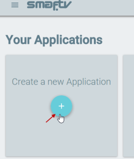
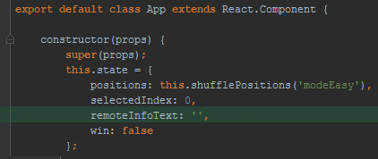

Smaf '15 Puzzle' React App
=====================

This is a Smaf demo app for the popular 15 puzzle game, created with the React.js library and the Smaf SDK.
 
The app demonstrates the SMAF's cross-device remote (keyboard) handling.

By pressing the 'UP', 'DOWN', 'LEFT' and 'RIGHT' buttons on your TV remote (or your mobile/desktop keyboard) you can change the active cell and by pressing 'ENTER' you can swap its position with the "blank" cell.
 
You can also experience the cross-device handling of the "colored" buttons, such as the 'RED' and 'GREEN' buttons. By pressing these buttons you can restart the game (at a different difficulty level each).

## Project Setup

This project is ready to use, as long as you get a new SMAF token from your **smaf.tv** account at https://www.smaf.tv/ui/login.html (read how [below](#user-content-get-token)). 

Clone the project:

`git clone https://github.com/InfamousLabsLimited/react-smaf-15-puzzle.git`

(important note: we will 'rebase' this project when needed to update its dependencies or its 'smaf.js' file, so do not depend on 'pull')

Install the npm packages:

`npm i` (or `sudo npm i`)

Run the **webpack** process to bundle the project:

`npm start` (to launch a server, open the app automatically on browser and make changes using hot loading)

OR

`npm run build` (to create the build and open the app manually)


## How to use the SMAF SDK on any project (like on this project)

### 1. Create/login to your smaf.tv account

Create/login to your **smaf.tv** account at https://www.smaf.tv/ui/login.html

### 2. Download the Smaf SDK

Click on the menu icon to open the menu...


...then click on the "Download Smaf" item to download the SDK:


### 3. Add the SMAF SDK library file to your project

Extract the `smaf.js` (or the `smaf.min.js`) file from the archive and add it to your project files:


### 4. Import (load) the Smaf library

Import the `smaf.js` file into your entry file of your project:

`main.js`


Related branch: https://github.com/InfamousLabsLimited/react-smaf-15-puzzle/tree/import-smaf-library

Related commit: https://github.com/InfamousLabsLimited/react-smaf-15-puzzle/commit/a5d2c1b9ba7e5d6252f6acbe95d92eb437073ed6

### 5. Make the imported 'Smaf' library object available to your React components

Expose the imported 'Smaf' library object to your React components by transferring it as a component property:

`main.js`


Related branch: https://github.com/InfamousLabsLimited/react-smaf-15-puzzle/tree/add-smaf-property

Related commit: https://github.com/InfamousLabsLimited/react-smaf-15-puzzle/commit/12c1446446198ebe75e27c4abad32d934f5b09aa

You can then use the Smaf object inside the components as `this.props.Smaf` (see below)

### 6. Initialize Smaf

Initialize Smaf through the 'this.props.Smaf.init()' method on your root React component:

`app.js`


Related branch: https://github.com/InfamousLabsLimited/react-smaf-15-puzzle/tree/initialize-smaf

Related commit: https://github.com/InfamousLabsLimited/react-smaf-15-puzzle/commit/6f30fbfb397925d951a4e0c94d9ccf165bf5d5ec

<a name="get-token"></a>
**Note:** It is important that you **get your own token** for the app, so that you have your **own analytics and more**.

This is how you get a token for your app:

If you have not created an app yet, click on the "+" button to create one:



Click on the app's icon:


Click on the `copy` button to copy the token:


Now you are ready to use all the methods and functionality of the SMAF SDK.

### 7. Add Smaf action handlers for certain actions

In this demo app, users play by pressing the 'UP', 'DOWN', 'LEFT', 'RIGHT', 'ENTER', 'RED' and 'GREEN' buttons on their TV remotes.

Every time the user presses one of these buttons, a websocket packet is sent to the Smaf server which responds with an object containing information on the key pressed (referred as *remote button info* below).

For the demo app to handle these key presses you need to add an *action handler* (i.e. a function) for each of these buttons.

This is how you do it:

* First, for better organization of your code, create a separate file (eg: `smafActions.js`) where you add your action handlers per **remote button** you are interested to handle (read here for the [supported remote control buttons](http://docs.smaf.tv/docs/remote-control)).

`smafActions.js:`
````javascript
// Set all action callbacks
export default {
    // Set the arrows/enter callbacks
    'LEFT': navigationGoLeft,
    'RIGHT': navigationGoRight,
    'UP': navigationGoUp,
    'DOWN': navigationGoDown,
    'ENTER': navigationEnter,
    'RED': playEasy,
    'GREEN': playNormal
};


function navigationGoLeft() {
    let selectedIndex = this.state.selectedIndex > 0
        ? this.state.selectedIndex - 1
        : this.state.selectedIndex + 14;

    this.setState({selectedIndex: selectedIndex});

    if (this.state.positions[this.state.selectedIndex] === 0) {
        navigationGoLeft.call(this);
    }
}


function navigationGoRight() {
    let selectedIndex = (this.state.selectedIndex + 1) % 16;

    this.setState({selectedIndex: selectedIndex});

    if (this.state.positions[this.state.selectedIndex] === 0) {
        navigationGoRight.call(this);
    }
}


function navigationGoUp() {
    let selectedIndex = this.state.selectedIndex > 3
        ? this.state.selectedIndex - 4
        : this.state.selectedIndex + 12;

    this.setState({selectedIndex: selectedIndex});

    if (this.state.positions[this.state.selectedIndex] === 0) {
        navigationGoUp.call(this);
    }
}


function navigationGoDown() {
    let selectedIndex = (this.state.selectedIndex + 4) % 16;

    this.setState({selectedIndex: selectedIndex});

    if (this.state.positions[this.state.selectedIndex] === 0) {
        navigationGoDown.call(this);
    }
}


function navigationEnter() {
    let key = this.state.positions[this.state.selectedIndex];
    this.updatePosition(key);
}


function playEasy() {
    this.setState({
        positions: this.shufflePositions('modeEasy'),
        win: false
    });
}


function playNormal() {
    this.setState({
        positions: this.shufflePositions('modeNormal'),
        win: false
    });
}
````

* Import the `smafActions.js` file to your React component so that you can have access to the handlers:

`app.js`


* Add the following code at the `componentDidMount()` lifecycle method so that you register all action handlers once for the entire life of the component:

`app.js`

````javascript
    componentDidMount() {
        this.smafActionHandler = function (data) {
            this.setState({remoteInfoText: JSON.stringify(data)});
            if (smafActions[data.command] && data.type === 'keyDown') {
                smafActions[data.command].call(this);
            }
        }.bind(this);
        this.props.Smaf.on('action', this.smafActionHandler);
    }
````

* Don't forget to also add the following code at the `componentWillUnmount()` lifecycle method so that all action handlers unregister when the component unmounts:


`app.js`

````javascript
    componentWillUnmount() {
        this.props.Smaf.off('action', this.smafActionHandler);
    }
````

Related branch: https://github.com/InfamousLabsLimited/react-smaf-15-puzzle/tree/add-smaf-action-handlers

Related commit: https://github.com/InfamousLabsLimited/react-smaf-15-puzzle/commit/94e2fc38f634d5ad79693e33d71e5f0499723531

### That's it! You can now handle all buttons pressed by using the appropriate code.

---
Extras:
* The following code on the branch above is optional and shows how you can save the *remote button info* received from the Smaf server into your React component's state for further handling (like showing it in `console` when the component renders):

`app.js`



`app.js`


`app.js`


* The following code on the next branch shows how you can display the *remote button info* that was previously saved into your component's state by the `this.smafActionHandler` action handler:

`app.js`


Related branch: https://github.com/InfamousLabsLimited/react-smaf-15-puzzle/tree/show-remote-info

Related commit: https://github.com/InfamousLabsLimited/react-smaf-15-puzzle/commit/e1da4549b1037fb28b3a01e197a8564c8f5e3510
